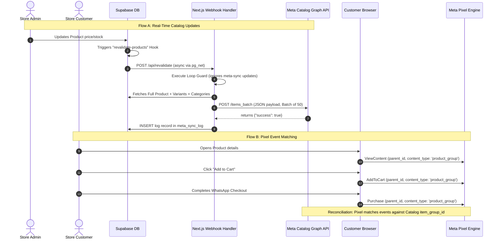

# 📖 Zaynahs E-Store — Manual Setup & Tracking Pixels Guide

This guide describes how to configure the newly integrated **Tracking Pixels**, **SEO Variables**, and **AI Settings** on Zaynahs E-Store, along with steps for acquiring IDs and credentials.

---

## 🔗 1. Analytics & Tracking Pixels Setup

You can configure all pixels in the admin dashboard under the **Pixels & SEO** tab. Below is how to obtain the ID for each platform:

### 1.1 Meta Pixel / Dataset ID (Facebook)
1. Go to the [Meta Events Manager](https://business.facebook.com/events_manager).
2. Click on **Datasets** in the left menu.
3. You will see a list of your datasets/pixels. Pay close attention to their icons and integrations:
   * 🌐 **Dataset ID (Web Pixel) — [🟢 USE THIS]:** Look for the dataset matching your website name (e.g., `zaynahs E Store` with the ID `1704133667288695`). It will list **Meta Pixel** or **Web** under integrations. This tracks browser actions (PageViews, AddToCart, Purchase) on your storefront.
   * 📱 **Mobile App ID — [❌ DO NOT USE]:** This has a mobile phone icon next to it. It is only for native iOS/Android apps, not websites.
   * 🗄️ **Offline Event Set / Unintegrated IDs — [❌ DO NOT USE]:** These are for physical store purchases or are empty.
4. Copy the number string of the **Dataset ID (Web Pixel)** (e.g., `1704133667288695`) shown directly below the dataset name.
5. Paste it in the **Meta Pixel ID (Facebook)** field in your store admin panel under **Settings -> Pixels & SEO** and click **Save Settings**.

> [!NOTE]
> **Meta Naming Update:** Meta has renamed "Meta Pixel" to "Dataset" in the Events Manager interface. In the codebase and settings form, "Meta Pixel ID" and "Dataset ID" refer to the same thing: your web tracking ID.


### 1.2 Google Analytics 4 (GA4)
1. Sign in to your [Google Analytics Account](https://analytics.google.com/).
2. Navigate to **Admin** (gear icon) -> **Data Streams** (under the Property column).
3. Click **Add Stream** -> **Web**, enter your website URL, and create the stream.
4. Copy the **Measurement ID** (begins with `G-`, e.g., `G-1A2BC3DE4F`).
5. Paste it in the **GA4 Measurement ID** field in the store admin panel.

### 1.3 Google Tag Manager (GTM)
1. Go to [Google Tag Manager](https://tagmanager.google.com/).
2. Create a container for your website URL.
3. Copy the container ID displayed at the top right of the dashboard (begins with `GTM-`, e.g., `GTM-A1BC2D3`).
4. Paste it in the **GTM Container ID** field in the store admin panel.

### 1.4 TikTok Pixel
1. Access the [TikTok Ads Manager](https://ads.tiktok.com/).
2. Navigate to **Assets** -> **Events** -> **Web Events**.
3. Click **Set Up Web Events**, name your pixel, and choose **TikTok Pixel**.
4. Copy the generated **Pixel ID** (e.g., `C1234567890ABCDEFGH`).
5. Paste it in the **TikTok Pixel ID** field in the store admin panel.

### 1.5 Snapchat Pixel
1. Log into your [Snap Ads Manager](https://ads.snapchat.com/).
2. Go to the top navigation and click **Events Manager**.
3. Click **New Data Source** -> **Web** -> **Snap Pixel**.
4. Copy the **Pixel ID** (a UUID string, e.g., `xxxxxxxx-xxxx-xxxx-xxxx-xxxxxxxxxxxx`).
5. Paste it in the **Snapchat Pixel ID** field in the store admin panel.

### 1.6 Pinterest Tag
1. Go to [Pinterest Ads Manager](https://ads.pinterest.com/).
2. Select **Ads** -> **Conversions**.
3. Click **Pinterest Tag** -> **Install Pinterest Tag**.
4. Copy the **Tag ID** (e.g., `26XXXXXXXXXXX`).
5. Paste it in the **Pinterest Tag ID** field in the store admin panel.

### 1.7 Twitter / X Pixel
1. Open the [X Ads Manager](https://ads.x.com/).
2. Go to **Tools** -> **Events Manager**.
3. Click **Add Event Source** -> **Universal Pixel**.
4. Copy the generated **Pixel ID** (usually a short code like `xxxxx`).
5. Paste it in the **Twitter / X Pixel ID** field in the store admin panel.

---

## 🎨 2. SEO & Social Meta Configuration

These options are also found under the **Pixels & SEO** tab:

1. **Meta Title Suffix**: A suffix automatically appended to every page title. 
   - **Recommended value**: ` | Zaynahs` or ` | Zaynahs E-Store`.
   - This ensures all product page headers look professional (e.g. `Raw Silk Kurta | Zaynahs`).
2. **Twitter / X Handle**: Your brand's Twitter handle (e.g., `@zaynahs_pk`). 
   - This binds to meta tags so product social shares mention your brand handle.

---

## 🧠 3. AI Settings & Credentials

Configure text copywriting and image vision capabilities in the **AI Settings** tab:

### 3.1 Content Copywriter & SEO Generator
Used to write product titles, descriptions, and SEO details dynamically.
- **Provider**: Select your provider (e.g., Groq, OpenAI, Google Gemini, Anthropic Claude).
- **Model**: Specify the model identifier (e.g., `llama-3.3-70b-versatile` for Groq, `gpt-4o-mini` for OpenAI).
- **API Key**: Enter the respective API key.

### 3.2 Vision & Media Analyzer
Used to analyze product photos, automatically suggest tags, categories, and colors.
- **Provider**: Select your vision provider (e.g., Google Gemini, OpenAI).
- **Model**: Specify the model (e.g., `gemini-2.0-flash` or `gpt-4o`).
- **API Key**: Enter the respective API key.

### 3.3 Persona & Language
- **Tone**: Select the tone of voice (e.g., Bold & Persuasive, Elegant & Luxury-focused).
- **Language**: Choose English, Urdu, or Roman Urdu.
- **Custom System Instructions**: Any specific instructions (e.g., *"Always mention premium fabrics and emphasize the traditional Pakistani craftsmanship"*).

---

## ✉️ 4. Email & SMTP Configuration

You can configure your SMTP credentials in the admin dashboard under the **Email & SMTP** tab:

1. **Gmail SMTP Address**: Your sender Gmail address (e.g. `admin@gmail.com`).
2. **Gmail App Password**: Your generated Google App Password (16-character code, spaces are automatically ignored).
3. **From Name**: The display name shown in email headers (e.g. `Zaynahs E-Store`).
4. **Admin Notification Email**: The address that receives stock warnings, custom order logs, and reviews.
5. **Low Stock Warning Threshold**: The stock limit that triggers low-stock alerts.
6. **Notification Templates**: Enable or disable individual customer/admin email notifications under the **Templates Customizer** sub-settings.

### How to Generate a Gmail App Password:
1. Go to [myaccount.google.com](https://myaccount.google.com/).
2. Select **Security** from the left panel.
3. Under *How you sign in to Google*, ensure **2-Step Verification** is turned **ON**.
4. In the search bar at the top, type **App passwords** and select it.
5. Enter a name for the app password (e.g., `"Zaynahs Store"`) and click **Create**.
6. Copy the 16-character code displayed in the yellow box (spaces are ignored) and paste it into the **Gmail App Password** field in the admin panel.
7. Click **Send Test Email** to verify settings.

> [!NOTE]
> **Email Notifications & WhatsApp Flow:**
> The primary storefront checkout and order confirmations prioritize the WhatsApp messaging flow. Email notifications run concurrently in the background to provide automated order receipts, fulfillment status updates, and admin stock/review alerts.

---

## ⚡ 5. Cache Revalidation & Database Webhooks (Tiered Cache System)

The Zaynahs E-Store uses a multi-layer tiered cache architecture (Browser cache + Cloudflare Edge CDN + Next.js Vercel ISR) to achieve Shopify-level performance and fast page load speeds.

### 5.1 Cloudflare Cache Rules
To optimize static assets and prevent non-static page caching issues, configure the following **Cache Rules** on your Cloudflare dashboard:

1. **Rule 1: No Cache (Cart/Checkout)**
   - **Name**: `no-cache-pages`
   - **Expression**: `(http.request.uri.path contains "/cart") or (http.request.uri.path contains "/checkout") or (http.request.uri.path contains "/account") or (http.request.uri.path contains "/api")`
   - **Settings**: Bypass Cache (Cache status: Bypass)

2. **Rule 2: Static Assets**
   - **Name**: `static-assets`
   - **Expression**: `(http.request.uri.path contains "/_next/static/")`
   - **Settings**: Cache everything, Edge TTL: 1 year

3. **Rule 3: Supabase Storage Images**
   - **Name**: `supabase-images`
   - **Expression**: `(http.host contains "supabase.co")`
   - **Settings**: Cache everything, Edge TTL: 30 days

4. **Rule 4: HTML Pages**
   - **Name**: `html-pages`
   - **Expression**: `/*` (wildcard/remaining paths)
   - **Settings**: Cache everything, Edge TTL: 1 minute

Also, enable **Auto Minify** (HTML, CSS, JS) and **Brotli Compression** under Cloudflare -> Speed -> Optimization.

---

### 5.2 Environment Variables Configuration
Ensure the following variables are set in both your `.env.local` file and **Vercel Dashboard**:

```bash
# === Supabase Core Connection (Required) ===
NEXT_PUBLIC_SUPABASE_URL=https://your-supabase-id.supabase.co
NEXT_PUBLIC_SUPABASE_ANON_KEY=your_supabase_anon_public_key
SUPABASE_SERVICE_ROLE_KEY=your_supabase_service_role_key
DATABASE_URL=postgresql://postgres.your-supabase-id:... (Connection Pooler for Prisma/Supa)
DIRECT_URL=postgresql://postgres.your-supabase-id:... (Direct DB Connection)

# === Cache Revalidation & Cloudflare CDN (Required) ===
# Webhook validation token (must match the x-revalidate-secret header in Supabase webhooks)
REVALIDATE_SECRET=your_strong_random_secret_string

# Cloudflare Purge API credentials
CLOUDFLARE_ZONE_ID=your_cloudflare_zone_id
CLOUDFLARE_API_TOKEN=your_cloudflare_cache_purge_api_token

# Store public URL (required for purging cache, sitemaps, robots, breadcrumbs)
NEXT_PUBLIC_SITE_URL=https://your-domain.vercel.app

# === SEO & Search Engine Submission (Optional but Recommended) ===
GOOGLE_SITE_VERIFICATION=your_google_site_verification_code
INDEXNOW_API_KEY=your_indexnow_api_key

# === Brand & Social Configuration (Optional) ===
NEXT_PUBLIC_BRAND_NAME=Zaynahs
NEXT_PUBLIC_TWITTER_HANDLE=@zaynahs_pk

# === Cloudflare Workers AI Credentials (Optional) ===
# Required only if you select Cloudflare as your text or vision provider in admin dashboard
CF_ACCOUNT_ID=your_cloudflare_account_id

# === Automated System Cron (Optional) ===
# Verification secret for background crons (e.g. review request follow-ups)
CRON_SECRET=your_strong_cron_secret_string
```

---

### 5.3 Supabase Database Webhooks Setup
Navigate to your **Supabase Project -> Database -> Webhooks** and configure three webhooks pointing to your deployment's revalidation API:

#### 1. Products Webhook
- **Name**: `revalidate-products`
- **Table**: `products`
- **Events**: `INSERT`, `UPDATE`, `DELETE`
- **HTTP Method**: `POST`
- **URL**: `https://<your-storefront-domain>/api/revalidate`
- **Headers**:
  - Key: `x-revalidate-secret`
  - Value: `your_strong_random_secret_string` (matching `REVALIDATE_SECRET`)

#### 2. Banners Webhook
- **Name**: `revalidate-banners`
- **Table**: `banners` (or `homepage_sections` if managed dynamically)
- **Events**: `INSERT`, `UPDATE`, `DELETE`
- **HTTP Method**: `POST`
- **URL**: `https://<your-storefront-domain>/api/revalidate`
- **Headers**:
  - Key: `x-revalidate-secret`
  - Value: `your_strong_random_secret_string`

#### 3. Categories Webhook
- **Name**: `revalidate-categories`
- **Table**: `categories`
- **Events**: `INSERT`, `UPDATE`, `DELETE`
- **HTTP Method**: `POST`
- **URL**: `https://<your-storefront-domain>/api/revalidate`
- **Headers**:
  - Key: `x-revalidate-secret`
  - Value: `your_strong_random_secret_string`

---

### 5.4 Testing Cache Revalidation
1. **Verify Endpoint Presence**: Open `https://<your-storefront-domain>/api/revalidate` in a browser. It should return a **405 Method Not Allowed** error (since it only accepts POST requests). If it returns a 404, check that Vercel is deployed correctly.
2. **Verify Security**: Trigger a POST to the endpoint using a REST client (like Postman or curl) without the `x-revalidate-secret` header. It should return a **401 Unauthorized** error.
3. **Verify Webhook Logs**: Go to **Supabase -> Database -> Webhooks -> [webhook name] -> Logs** to ensure requests return a **200 OK** response on DB modifications.

---

## 🔍 6. Search Engine Submission Setup (Manual Actions)

To enable automatic Google and Bing indexing (as well as Perplexity/ChatGPT AI Search engines), complete these one-time manual steps:

### 6.1 Google Search Console Verification
1. Go to [Google Search Console](https://search.google.com/search-console).
2. Click **Add Property** and enter your production domain (e.g. `https://your-domain.vercel.app`).
3. Select **HTML tag** as your verification method.
4. Copy the code in the tag (specifically the value inside `content="..."`).
5. Open your Vercel Dashboard/`.env.local` and set `GOOGLE_SITE_VERIFICATION` to this value.
6. Once deployed/saved, click **Verify** in the Search Console.
7. Go to **Sitemaps** in the left menu and submit your sitemap URL: `https://your-domain.vercel.app/sitemap.xml`.

### 6.2 Bing Webmaster Tools & IndexNow Verification
1. Go to [Bing Webmaster Tools](https://www.bing.com/webmasters).
2. Sign in and select **Import from Google Search Console** (this automatically imports your domain and verification settings in one click).
3. If importing is not used, verify using the HTML tag or DNS record.
4. Set up **IndexNow** (instant ping for Bing, Yandex, Naver):
   - Go to [IndexNow Get Started](https://www.bing.com/indexnow/getstarted).
   - Generate your API Key.
   - Set the `INDEXNOW_API_KEY` variable in Vercel to this key value.
   - Create a text file named exactly `[your-api-key].txt` inside the `/public` folder of your project (containing only the key value as text). This allows search bots to verify ownership during API pings.
   - The store will now automatically ping IndexNow whenever new products or categories are modified.

---

## 👥 7. Meta Catalog Real-time Sync Setup (Manual Actions)

To synchronize your storefront catalog automatically with your Facebook Shop, Instagram Shop, and WhatsApp Catalog, follow these manual configuration steps:

### 7.1 Meta Business Manager & Commerce Manager Setup
1. Go to the [Meta Business Manager](https://business.facebook.com/).
2. Navigate to the **Commerce Manager** -> **Catalogs** and click **Create Catalog**.
3. Select **E-Commerce** -> **Online Products** -> click **Next**.
4. Enter a catalog name (e.g. `Zaynahs Store Catalog`) and select your Business Account.
5. Copy the **Catalog ID** shown in Commerce Manager (a string of numbers).
6. Set the `META_CATALOG_ID` environment variable in Vercel/`.env.local` to this ID.

### 7.2 System User, Permanent Access Token & Dataset Permissions
1. Go to **Business Settings** -> **Users** -> **System Users**.
2. Click **Add** -> Name it `Zaynahs Sync Bot` and select **Admin** role.
3. Assign Catalog Asset:
   * Click **Add Assets** -> Select **Catalogs** -> Choose your catalog -> Check **Full Control** -> click **Save**.
4. Assign Dataset Asset (Required for Pixel integrations):
   * Click **Add Assets** -> Select **Datasets** -> Choose your website dataset (e.g., `zaynahs E Store`) -> Check **Full Control (Manage events dataset)** -> click **Save**.
5. Click **Generate New Token**:
   * Select your Meta App (Create one of type **Business** at [developers.facebook.com](https://developers.facebook.com/) if not already done).
   * Check the permissions:
     - `catalog_management`
     - `business_management`
   * Click **Generate Token** and immediately copy the permanent token (it will only be shown once).
6. Set the `META_ACCESS_TOKEN` environment variable in Vercel/`.env.local` to this token.
7. (Optional) Set `META_GRAPH_API_VERSION` to `v21.0`.

### 7.3 Linking Web Dataset to Catalog in Commerce Manager
To resolve "0% match rate" errors and connect your website tracking to the product catalog:
1. Go to **Commerce Manager** -> Select your Catalog -> Navigate to **Catalog** -> **Events**.
2. Click on **Manage connections** at the top.
3. You will see a list of connected datasets/apps. To prevent tracking conflicts:
   * 📱 **Meta SDK (Mobile App ID) — [❌ TURN OFF]:** Toggle this OFF.
   * 🌐 **zaynahs E Store (Dataset ID `1704133667288695`) — [🟢 TURN ON]:** Toggle this ON. This represents the website pixel dataset.
4. Click **Save**. The catalog is now correctly linked to your website's tracking dataset.

### 7.4 Category Mapping in Store Settings
1. Log into your store's Admin Panel and navigate to **Settings** -> **Meta Sync** tab.
2. For each store category, select the standard Meta Google Product Category path from the dropdown, or select **Custom...** and enter the custom path.
3. Click **Save Mappings**. Products in these categories will now sync using the mapped Meta category.

### 7.5 Bulk Initial Sync
1. Navigate to **Admin Panel** -> **Products**.
2. Click **Sync All to Meta** to perform the initial bulk catalog push. It chunks products in batches of 50 and submits them to your Facebook catalog.
3. Check the status badge under the **Meta Sync** column for each product. If any products display `Error`, hover/click the badge to read the error message returned from Meta's API.

## Meta Catalogue Setup (Completed: June 17, 2026)

**Catalogue Name**: totvogue e-store  
**Catalogue ID**: `2074732203477347`  
**Pixel Connected**: zaynahs E Store (`2492514861194573`)  

**System User**: zaynahs sync bot (ID: `61590835017786`)  
- Assets assigned: totvogue e-store catalogue (Full access)  
- Token: generate from Business Settings → System Users → zaynahs sync bot → Generate Token  

**Vercel ENV vars needed**:
```bash
META_CATALOG_ID=2074732203477347
META_ACCESS_TOKEN=<generate_from_system_user>
META_GRAPH_API_VERSION=v21.0
NEXT_PUBLIC_META_PIXEL_ID=2492514861194573
```

---

## ⚙️ 8. Meta Catalog Sync & Event Matching System Architecture (Technical Deep-Dive)

This section provides a complete reference for any developer or AI Agent looking to understand, replicate, or troubleshoot the Meta Catalog Sync and Event Matching System.

---

### 8.1 Core System Architecture & Data Flow

The system coordinates real-time catalog syncing and browser-side tracking events to ensure Meta Business Suite knows about every product modification instantly, and can attribute 100% of user pageviews, carts, and checkouts to catalog items.



---

### 8.2 System Requirements & Prerequisites
To deploy or replicate this system on any project, you need:
1. **Supabase Project** with the standard PostgreSQL extensions enabled (`uuid-ossp` and `pg_net` for asynchronous webhooks).
2. **Next.js Storefront** hosting client tracking code and the secure server endpoints.
3. **Meta Business Assets**:
   * A **Meta Developer App** (type: *Business*).
   * A **Meta Business Manager** account containing a Product Catalog.
   * An **Admin System User** in Business Manager with full control over the catalog.
   * A **Permanent Access Token** generated for the system user with `catalog_management` and `business_management` permissions.
   * A **Meta Pixel** connected to the catalog in Commerce Manager.

---

### 8.3 Supabase Database DDL Schema & Webhooks Setup

To set up the database layer, run these commands in the Supabase SQL Editor.

#### 1. Columns Added to the `products` Table
These columns are used to track sync state and display sync status badges in the admin panel:
```sql
ALTER TABLE public.products 
ADD COLUMN IF NOT EXISTS meta_sync_status TEXT DEFAULT 'pending' CHECK (meta_sync_status IN ('pending', 'synced', 'error')),
ADD COLUMN IF NOT EXISTS meta_sync_error TEXT,
ADD COLUMN IF NOT EXISTS meta_last_synced_at TIMESTAMPTZ;
```

#### 2. Category Mapping Table
Meta expects standardized Google Product Categories for products. This table maps your internal categories to Meta standard paths:
```sql
CREATE TABLE IF NOT EXISTS public.meta_category_mapping (
  id UUID PRIMARY KEY DEFAULT gen_random_uuid(),
  store_category_id UUID NOT NULL REFERENCES public.categories(id) ON DELETE CASCADE UNIQUE,
  meta_category TEXT NOT NULL, -- e.g., 'Apparel & Accessories > Clothing > Outerwear'
  created_at TIMESTAMPTZ DEFAULT NOW()
);

-- Enable RLS and define policies
ALTER TABLE public.meta_category_mapping ENABLE ROW LEVEL SECURITY;

CREATE POLICY "Public read meta mappings" ON public.meta_category_mapping FOR SELECT USING (true);
CREATE POLICY "Admin all meta mappings" ON public.meta_category_mapping FOR ALL USING (auth.role() = 'authenticated');
```

#### 3. Meta Sync Log Table
To prevent recursive triggers (where syncing writes back to the product table, triggering a new webhook, which triggers a new sync in an infinite loop), **never write status updates back to the `products` table**. Instead, write logs to a dedicated table:
```sql
CREATE TABLE IF NOT EXISTS public.meta_sync_log (
  id          UUID PRIMARY KEY DEFAULT gen_random_uuid(),
  product_id  UUID NOT NULL REFERENCES public.products(id) ON DELETE CASCADE,
  status      TEXT NOT NULL CHECK (status IN ('synced', 'error', 'skipped')),
  error       TEXT,
  action      TEXT NOT NULL DEFAULT 'UPDATE' CHECK (action IN ('UPDATE', 'DELETE')),
  created_at  TIMESTAMPTZ NOT NULL DEFAULT NOW()
);

CREATE INDEX IF NOT EXISTS idx_meta_sync_log_product_id ON public.meta_sync_log(product_id);
CREATE INDEX IF NOT EXISTS idx_meta_sync_log_created_at ON public.meta_sync_log(created_at DESC);

-- Enable RLS and define policies
ALTER TABLE public.meta_sync_log ENABLE ROW LEVEL SECURITY;

CREATE POLICY "Admin read meta_sync_log" ON public.meta_sync_log FOR SELECT USING (auth.role() = 'authenticated');
CREATE POLICY "Service role insert meta_sync_log" ON public.meta_sync_log FOR INSERT WITH CHECK (true);
```

#### 4. Asynchronous HTTP Webhook Function (`pg_net`)
Supabase webhooks use the `pg_net` extension to handle HTTP requests asynchronously. Define this trigger function in a schema (e.g. `supabase_functions`):
```sql
CREATE EXTENSION IF NOT EXISTS pg_net;
CREATE SCHEMA IF NOT EXISTS supabase_functions;

CREATE OR REPLACE FUNCTION supabase_functions.http_request()
RETURNS trigger
LANGUAGE plpgsql
SECURITY DEFINER
AS $$
DECLARE
  url text := TG_ARGV[0];
  method text := TG_ARGV[1];
  headers_str text := TG_ARGV[2];
  params_str text := TG_ARGV[3];
  timeout_str text := TG_ARGV[4];
  
  headers jsonb;
  params jsonb;
  payload jsonb;
  timeout_ms integer;
BEGIN
  BEGIN
    headers := headers_str::jsonb;
  EXCEPTION WHEN OTHERS THEN
    headers := '{}'::jsonb;
  END;

  BEGIN
    params := params_str::jsonb;
  EXCEPTION WHEN OTHERS THEN
    params := '{}'::jsonb;
  END;

  timeout_ms := COALESCE(timeout_str::integer, 5000);

  -- Build payload structure matching standard Supabase webhook expectations
  IF TG_OP = 'INSERT' THEN
    payload := jsonb_build_object(
      'type', TG_OP,
      'table', TG_TABLE_NAME,
      'schema', TG_TABLE_SCHEMA,
      'record', to_jsonb(NEW),
      'old_record', NULL
    );
  ELSIF TG_OP = 'UPDATE' THEN
    payload := jsonb_build_object(
      'type', TG_OP,
      'table', TG_TABLE_NAME,
      'schema', TG_TABLE_SCHEMA,
      'record', to_jsonb(NEW),
      'old_record', to_jsonb(OLD)
    );
  ELSIF TG_OP = 'DELETE' THEN
    payload := jsonb_build_object(
      'type', TG_OP,
      'table', TG_TABLE_NAME,
      'schema', TG_TABLE_SCHEMA,
      'record', NULL,
      'old_record', to_jsonb(OLD)
    );
  END IF;

  -- Asynchronously enqueue HTTP POST request
  PERFORM net.http_post(
    url := url,
    body := payload,
    headers := headers,
    timeout_milliseconds := timeout_ms
  );

  IF TG_OP = 'DELETE' THEN
    RETURN OLD;
  ELSE
    RETURN NEW;
  END IF;
END;
$$;
```

#### 5. Webhook Triggers
Enable triggers on `products` and related child tables (e.g. variants, reviews, images) to fire webhooks to the storefront revalidation route:
```sql
DROP TRIGGER IF EXISTS "revalidate-products" ON public.products;
CREATE TRIGGER "revalidate-products"
  AFTER INSERT OR UPDATE OR DELETE
  ON public.products
  FOR EACH ROW
  EXECUTE FUNCTION supabase_functions.http_request(
    'https://your-production-domain.com/api/revalidate',
    'POST',
    '{"Content-Type":"application/json","x-revalidate-secret":"your_revalidate_secret_key"}',
    '{}',
    '5000'
  );
```

---

### 8.4 Server-Side Logic (Next.js)

#### 1. Next.js Webhook Handler & Loop Guard
In [app/api/revalidate/route.ts](file:///Users/shoaib/Desktop/Zaynahs%20e-store/app/api/revalidate/route.ts), a **Loop Guard** is mandatory. If an update webhook only modifies meta synchronization fields, the endpoint must abort instantly.

```typescript
// Loop Guard Implementation inside POST endpoint
const META_ONLY_COLUMNS = new Set(['meta_sync_status', 'meta_sync_error', 'meta_last_synced_at', 'updated_at']);

if (type === 'UPDATE' && record && old_record) {
  // Find which columns changed
  const changedColumns = Object.keys(record).filter(
    (key) => record[key] !== old_record[key]
  );
  
  const isMetaOnly = changedColumns.length > 0 && changedColumns.every((col) => META_ONLY_COLUMNS.has(col));
  
  if (isMetaOnly) {
    console.log('[Webhook Revalidate] Skipping — only meta_sync fields changed. Prevents loop.');
    return NextResponse.json({ revalidated: false, reason: 'meta_sync_only' });
  }
}
```

#### 2. The Product Mapper (`mapProductToMeta`)
Meta strictly expects catalog items to map database fields. Here is the standardized mapping schema logic in [lib/meta/mapProduct.ts](file:///Users/shoaib/Desktop/Zaynahs%20e-store/lib/meta/mapProduct.ts):

*   **id**: Mapped to the specific item identifier. For variant items, it is `variant.id`. For simple items, it is `product.id`.
*   **item_group_id**: **CRITICAL FOR EVENT MATCHING**. Always set to the parent `product.id` (whether the item is a variant or simple product).
*   **title**: Standard name key. Must be `title` (Meta does not accept `name`).
*   **link**: Complete URL to the product page.
*   **image_link**: Primary image URL (Meta does not accept `image_url`).
*   **additional_image_link**: Extra images joined as a **comma-separated string** (e.g. `img1.png,img2.png`). Meta rejects JSON arrays.
*   **availability**: Must map to `'in stock'` or `'out of stock'`.

```typescript
// lib/meta/mapProduct.ts
export function mapProductToMeta(product: Product, settings: StoreSettings, categoryMap: Record<string, string>): any[] {
  const brandName = settings.storeName || 'Zaynahs';
  const currency = settings.currency || 'PKR';
  const siteUrl = process.env.NEXT_PUBLIC_SITE_URL || 'https://yourstore.com';
  
  const primaryImage = product.images?.find(img => img.isPrimary)?.url || product.images?.[0]?.url || '';
  const additionalImages = product.images?.filter(img => !img.isPrimary).map(img => img.url) || [];
  const categoryPath = (product.categoryId && categoryMap[product.categoryId]) || 'Apparel & Accessories > Clothing';

  if (product.hasVariants && product.variants && product.variants.length > 0) {
    return product.variants.filter(v => v.active).map(v => {
      const nameParts = [product.name];
      if (v.color) nameParts.push(v.color);
      if (v.size) nameParts.push(v.size);
      return {
        id: v.id,                         // Variant unique ID
        item_group_id: product.id,        // Mapped to parent ID for grouping
        title: nameParts.join(' - '),
        description: product.description || product.name,
        price: `${v.price || product.price} ${currency}`,
        currency,
        availability: v.stock > 0 ? 'in stock' : 'out of stock',
        condition: 'new',
        link: `${siteUrl}/product/${product.slug}`,
        image_link: v.imageUrl || primaryImage,
        additional_image_link: additionalImages.length > 0 ? additionalImages.join(',') : undefined,
        brand: brandName,
        category: categoryPath,
        color: v.color || undefined,
        size: v.size || undefined
      };
    });
  }

  // Simple product
  return [{
    id: product.id,
    item_group_id: product.id,
    title: product.name,
    description: product.description || product.name,
    price: `${product.price} ${currency}`,
    currency,
    availability: product.stock > 0 ? 'in stock' : 'out of stock',
    condition: 'new',
    link: `${siteUrl}/product/${product.slug}`,
    image_link: primaryImage,
    additional_image_link: additionalImages.length > 0 ? additionalImages.join(',') : undefined,
    brand: brandName,
    category: categoryPath
  }];
}
```

#### 3. Batch Synchronization Handler (`/items_batch`)
Meta's Graph API batch endpoint chunking restricts updates to a maximum of 50 items per payload. 

*   **Endpoint**: `https://graph.facebook.com/{version}/{catalog_id}/items_batch`
*   **Method**: `POST`
*   **Required Header**: `x-revalidate-secret` to verify webhook sender.
*   **Payload Format**:
```json
{
  "item_type": "PRODUCT_ITEM",
  "requests": [
    {
      "method": "UPDATE",
      "retailer_id": "item_id_here",
      "data": {
        "id": "item_id_here",
        "item_group_id": "parent_product_id_here",
        "title": "Product Title",
        "description": "Product Description",
        "price": "1500 PKR",
        "currency": "PKR",
        "availability": "in stock",
        "condition": "new",
        "link": "https://domain.com/product/slug",
        "image_link": "https://domain.com/images/primary.png",
        "brand": "Store Name",
        "category": "Apparel & Accessories > Clothing"
      }
    }
  ]
}
```

> [!WARNING]
> **Duplicate retailer_id Errors:**
> Meta expects `retailer_id` at the top level of each request block, but strictly reads `"id"` inside the `"data"` block. If `"id"` is missing or named incorrectly inside `"data"`, Meta parses it as null/empty, throwing a `Duplicate retailer_id` batch error.

---

### 8.5 Client-Side Pixel Integration (Reconciling Events)

To guarantee a **100% Event Match Rate** in Meta Events Manager, the browser Pixel and Catalog IDs must match perfectly.

#### The Match Rate Issue:
If your catalog updates send variant IDs (`v.id`) but your browser Pixel events only send parent product IDs (`product.id`), Meta sees standard events (`ViewContent`, `AddToCart`) with IDs that do not exist as primary elements in the catalog. This drops the match rate to 0%.

#### The Solution:
1. Track the parent product ID (`product.id`) in all browser events.
2. Force the Pixel to match against the catalog's parent index by sending **`content_type: 'product_group'`**.
3. Reconcile this inside the catalog database payload by ensuring every variant item specifies its parent ID in `item_group_id: product.id`. Meta's engine will match the Pixel's `product_group` ID to the catalog's `item_group_id` matching keys.

#### Event Tracking Code Snippet (`lib/trackEvent.ts`):
```typescript
export function trackEvent(eventName: string, params: Record<string, any> = {}) {
  if (typeof window === 'undefined') return;
  try {
    const w = window as any;
    if (typeof w.fbq === 'function') {
      w.fbq('track', eventName, params);
    }
    console.log(`[Tracking] Event "${eventName}" fired with params:`, params);
  } catch (error) {
    console.error(`[Tracking] Error triggering event:`, error);
  }
}
```

#### Core Storefront Event Fire Conditions:

*   **ViewContent** (on product page mount):
    ```typescript
    trackEvent('ViewContent', {
      content_ids: [product.id],
      content_name: product.name,
      content_type: 'product_group', // Directs Meta to look for item_group_id
      value: product.price,
      currency: 'PKR'
    });
    ```
*   **AddToCart** (when customer adds item):
    ```typescript
    trackEvent('AddToCart', {
      content_ids: [product.id],
      content_name: product.name,
      content_type: 'product_group',
      value: unitPrice * quantity,
      currency: 'PKR'
    });
    ```
*   **InitiateCheckout** (on checkout step activation):
    ```typescript
    trackEvent('InitiateCheckout', {
      content_ids: items.map(item => item.product.id),
      content_type: 'product_group',
      value: totalPrice,
      currency: 'PKR',
      num_items: items.reduce((sum, item) => sum + item.quantity, 0)
    });
    ```
*   **Purchase** (on order submission):
    ```typescript
    trackEvent('Purchase', {
      transaction_id: order.orderNumber,
      value: finalTotal,
      currency: 'PKR',
      content_ids: items.map(item => item.product.id),
      content_type: 'product_group',
      num_items: items.reduce((sum, item) => sum + item.quantity, 0)
    });
    ```

---

### 8.6 Playbook: Cloning and Replicating the System Elsewhere

Any developer or AI Agent can replicate this catalog synchronization system in a new project by following this step-by-step implementation guide:

#### Step 1: Prepare the Target Database
1. Run the DDL setup script from **Section 8.3** to create `meta_sync_log`, `meta_category_mapping`, and add the sync tracking columns to your `products` table.
2. Enable the `pg_net` extension in your Supabase dashboard (Database -> Extensions -> pg_net).

#### Step 2: Establish the Server Services
1. Add the data mapper helper `mapProductToMeta` inside your codebase. Make sure it resolves variants into individual items with `item_group_id` mapped to the parent product's ID.
2. Set up the `syncProductToMeta` and `bulkSyncProductsToMeta` services. Include cached settings/mappings fetches to optimize database load, and ensure logging writes to `meta_sync_log` instead of writing back to the `products` table.

#### Step 3: Implement the Webhook Endpoint
1. Create the POST API endpoint (e.g. `/api/revalidate`) in your storefront.
2. Verify authorization by validating the request's header secret key against your environment configuration variable.
3. Write the **Loop Guard** checks to skip processing if changes only affect meta sync tracking columns.
4. Hook up the table router: fetch the modified records and pass them to your sync service.

#### Step 4: Configure Supabase Webhook Triggers
1. Set up database triggers on `products` and its child tables.
2. Configure the webhook headers with `x-revalidate-secret` mapping to your secret key, pointing the destination URL directly to your storefront webhook endpoint.

#### Step 5: Embed Storefront Pixels
1. Set up a global client-side pixel event tracking wrapper.
2. Embed the tracker triggers in your store components. Set `content_ids` to the parent product IDs, and explicitly pass `content_type: 'product_group'` to maximize catalog match rates.

#### Step 6: Verify and Run a Test Sync
1. Trigger a bulk sync manually via a dashboard action or a curl command.
2. Review the `meta_sync_log` database entries to verify that all variants and items synced successfully.

---

### 8.7 Troubleshooting Cheat Sheet

| Error Message / Symptom | Likely Cause | Solution |
| :--- | :--- | :--- |
| `Duplicate retailer_id in batch api call` | Inside the batch `data` block, the unique identifier field is missing, named wrong, or null. | Verify `mapProduct.ts`. Ensure that inside the `data` block, the key is named exactly `"id"` and has a valid value. |
| Products show "Title missing" or "Image missing" in Commerce Manager | Catalog fields were sent using custom names (e.g., `name` or `image_url`) instead of standard Meta schema keys. | Ensure mapping uses standard keys: `title` (not name), `link` (not url), `image_link` (not image_url). |
| "Products not matching ad events" warning in Events Manager (0% match rate) | Pixel events are sending parent IDs while the catalog indexes variants under variant IDs without matching grouping parameters. | Set `item_group_id` in the catalog to the parent product ID. Force the browser Pixel events to send `content_type: 'product_group'` and parent IDs. |
| Infinite updates loop in Supabase | Updating sync log status flags on the product table triggers a new update webhook, launching a recursion loop. | Do not save logs on the `products` table directly. Create a separate `meta_sync_log` table for transactions and query logs from there. |
| Webhook triggers fail in local environment | Localhost is inaccessible from external Supabase cloud networks. | Deploy to your staging/production host, or run a tunnel proxy (e.g. Ngrok) to route Supabase events to your local machine during development. |


