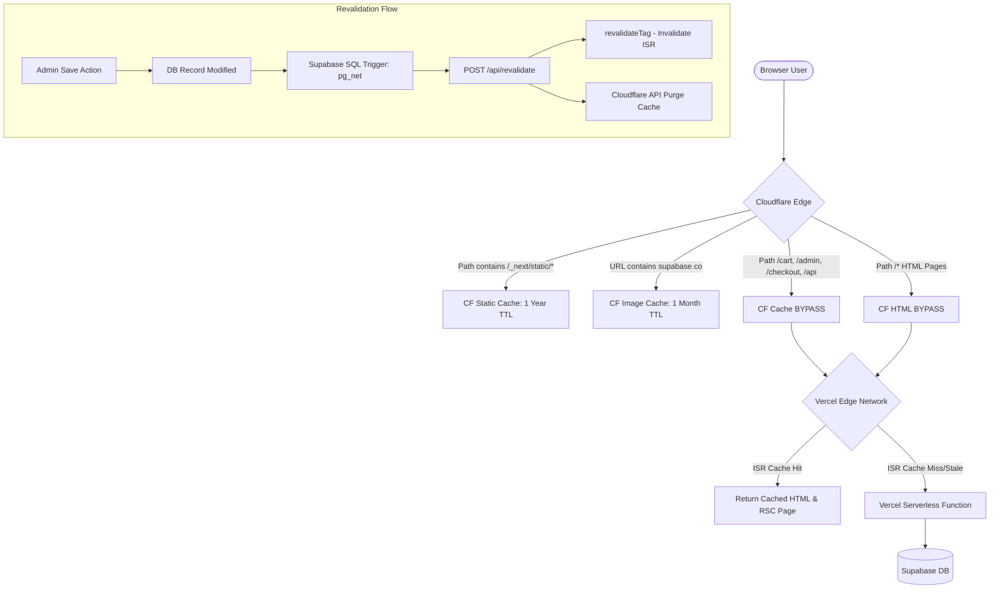

# 🏪 ZAYNAHS E-STORE — MASTER CACHE IMPLEMENTATION GUIDE

This document serves as the absolute source of truth and blueprint for the **Enterprise-Grade Caching and Revalidation System** implemented in Zaynahs E-Store. It is designed to act as a 1-click instruction manual for deploying this cache system on new project forks or clone deployments.

---

## 📌 Table of Contents
1. [Core Caching Philosophy](#-core-caching-philosophy)
2. [High-Level Architecture Diagram](#-high-level-architecture-diagram)
3. [Next.js ISR (Incremental Static Regeneration)](#-nextjs-isr-incremental-static-regeneration)
4. [Next.js 16 Caching Gotchas & Strict Standards](#-nextjs-16-caching-gotchas--strict-standards)
5. [Database-Level Webhook Triggers (Supabase)](#-database-level-webhook-triggers-supabase)
6. [Webhook Handler Endpoint (`/api/revalidate`)](#-webhook-handler-endpoint-apirevalidate)
7. [Cloudflare Edge CDN Rules & Automation](#-cloudflare-edge-cdn-rules--automation)
8. [Setup Checklist for New Forks](#-setup-checklist-for-new-forks)

---

## 💡 Core Caching Philosophy

To achieve sub-second page loads globally (comparable to Shopify) with minimal infrastructure overhead, Zaynahs E-Store uses a **dual-stage caching strategy**:

1. **Vercel Edge Network (ISR)**: Next.js is responsible for caching HTML and React Server Component (RSC) payloads. Because next-router navigation utilizes custom `Vary` headers, Next.js handles server-rendered page caching. We set a long cache TTL (24 Hours) and invalidate on-demand when settings or products change.
2. **Cloudflare Edge CDN**: Cloudflare is positioned in front of Vercel to cache heavy static assets (`/_next/static/*` for 1 year) and external images (Supabase storage objects for 1 month). This reduces serverless invocation costs and database query volume to virtually zero.

---

## 🏗️ High-Level Architecture Diagram



---

## ⚡ Next.js ISR (Incremental Static Regeneration)

We use `unstable_cache` to cache database queries and high `revalidate` page settings on static layouts to optimize server rendering.

### 1. Storefront Static Regeneration TTL
The storefront homepage and product detail screens are pre-generated at build time and cached for 24 hours:
```typescript
// app/(store)/page.tsx & app/(store)/product/[slug]/page.tsx
export const revalidate = 86400; // 24 hours (86,400 seconds)
```
Because the webhook system triggers instant invalidation on admin edits, we can cache pages for long durations without risking stale storefront content.

### 2. Pre-Rendering Product Pages (`generateStaticParams`)
To ensure immediate loading, all active product detail paths are pre-compiled into static HTML files during the Vercel build step:
```typescript
// app/(store)/product/[slug]/page.tsx
export async function generateStaticParams() {
  const products = await getProducts(); // Returns all active product objects
  return products.map((product) => ({
    slug: product.slug,
  }));
}
// New products added post-build render dynamically and cache instantly
export const dynamicParams = true;
```

### 3. Server Actions Cache Wrapper
Service queries in `lib/services/` are wrapped with Next.js `unstable_cache` and assigned tags for granular invalidation:
```typescript
// Example: lib/services/products.ts
export const getProducts = unstable_cache(
  async () => {
    return fetchProductsFromDb();
  },
  ['products-list-key'],
  { revalidate: 86400, tags: ['products'] }
);
```

---

## 🚨 Next.js 16 Caching Gotchas & Strict Standards

### Gotcha 1: `headers()` and `cookies()` Force Dynamic Rendering
Executing `headers()` or `cookies()` inside a Server Component (especially `generateMetadata()`) dynamically disables caching for that page, sending `cache-control: private, no-store, max-age=0` headers.
* **MANDATORY**: Never import or invoke `headers()` or `cookies()` in layout files (`app/(store)/layout.tsx`) or storefront pages.
* **Env Fallback**: Define domain URLs using environment variables:
  ```typescript
  const siteUrl = process.env.NEXT_PUBLIC_SITE_URL || 'https://www.totvogue.pk';
  ```

### Gotcha 2: Next.js 16 strict `revalidateTag` Types
In Next.js 16, TypeScript declarations require `revalidateTag` to be called with 2 arguments. However, Next's runtime environment only consumes 1. 
* **MANDATORY**: You must cast `revalidateTag` calls to `any` to prevent compile-time `tsc` argument count failures (`TS2554` error):
  ```typescript
  import { revalidateTag } from 'next/cache';
  (revalidateTag as any)('products'); // Allowed
  revalidateTag('products'); // Fails compilation
  ```

---

## 🗄️ Database-Level Webhook Triggers (Supabase)

Supabase triggers are written directly in the database. They listen for table changes and asynchronously enqueue HTTP requests to Vercel via the `pg_net` PostgreSQL extension, ensuring store updates are instantly reflected without blocking database transactions.

### 1. pg_net Trigger Function
```sql
CREATE OR REPLACE FUNCTION supabase_functions.http_request()
RETURNS trigger
LANGUAGE plpgsql
SECURITY DEFINER
AS $$
DECLARE
  url text := TG_ARGV[0];
  headers jsonb := TG_ARGV[2]::jsonb;
  payload jsonb;
BEGIN
  -- Build event payload
  IF TG_OP = 'INSERT' THEN
    payload := jsonb_build_object('type', TG_OP, 'table', TG_TABLE_NAME, 'record', to_jsonb(NEW));
  ELSIF TG_OP = 'UPDATE' THEN
    payload := jsonb_build_object('type', TG_OP, 'table', TG_TABLE_NAME, 'record', to_jsonb(NEW), 'old_record', to_jsonb(OLD));
  ELSIF TG_OP = 'DELETE' THEN
    payload := jsonb_build_object('type', TG_OP, 'table', TG_TABLE_NAME, 'old_record', to_jsonb(OLD));
  END IF;

  -- Asynchronously enqueue HTTP POST request
  PERFORM net.http_post(
    url := url,
    body := payload,
    headers := headers,
    timeout_milliseconds := 5000
  );

  IF TG_OP = 'DELETE' THEN RETURN OLD; ELSE RETURN NEW; END IF;
END;
$$;
```

### 2. Attaching Webhooks to Tables
Triggers are mapped to five core database tables:
```sql
CREATE TRIGGER "revalidate-products"
  AFTER INSERT OR UPDATE OR DELETE ON public.products
  FOR EACH ROW EXECUTE FUNCTION supabase_functions.http_request(
    'https://www.zaynahs.pk/api/revalidate',
    'POST',
    '{"Content-Type":"application/json","x-revalidate-secret":"zaynahs_secret_cache_revalidate_2026"}'
  );
```
*(Repeated for `categories`, `reviews`, `homepage_sections`, and `store_settings` tables).*

---

## 🔌 Webhook Handler Endpoint (`/api/revalidate`)

Located at `app/api/revalidate/route.ts`, this API route acts as the revalidation dispatcher. It validates requests using a secret token header, evaluates the payload table, and purges the appropriate cache tags.

### 1. Loop Guard Protection (CRITICAL)
If a webhook updates metadata fields on the same table it listens to, it can trigger an infinite revalidation loop. To prevent this, we enforce a strict loop guard checking column differences:
```typescript
const META_ONLY_COLUMNS = new Set(['meta_sync_status', 'meta_sync_error', 'meta_last_synced_at', 'updated_at']);

if (table === 'products' && type === 'UPDATE') {
  const changedColumns = Object.keys(record).filter(
    (key) => record[key] !== old_record[key]
  );
  const isMetaOnly = changedColumns.length > 0 && changedColumns.every((col) => META_ONLY_COLUMNS.has(col));
  
  if (isMetaOnly) {
    console.log('[Webhook] Skipping — loop guard blocked metadata sync updates.');
    return NextResponse.json({ revalidated: false, reason: 'meta_sync_only' });
  }
}
```

### 2. Child-to-Parent Relational Purging
When updates occur on helper tables (like variant pricing, product images, modifiers, or reviews), the handler identifies the parent product's ID, fetches its slug, and invalidates the primary detail page cache:
```typescript
const childTables = ['product_variants', 'product_images', 'product_modifiers', 'reviews'];

if (childTables.includes(table)) {
  const productId = activeRecord.product_id;
  const product = await getProductById(productId);
  if (product?.slug) {
    await revalidateProduct(product.slug); // Purges product details
  }
}
```

---

## ☁️ Cloudflare Edge CDN Rules & Automation

Cloudflare intercepts client traffic and serves static files directly from edge servers, reducing Vercel compute consumption.

### 1. Automated Deployer Script (`scripts/deploy-cloudflare-rules.js`)
This script uses the Cloudflare API to:
* Search for the specific Zone Cache Settings phase Ruleset ID.
* Atomically deploy the four core caching policies.
* Enable DNS verification TXT records.
* Automatically set CNAME records to "Orange Cloud" Proxied status.

Deploy by running:
```bash
node --env-file=.env.local scripts/deploy-cloudflare-rules.js
```

### 2. Cloudflare Cache Settings Ruleset

| Rule Name | Target Expression | Action | Cache TTL / Configuration |
|---|---|---|---|
| **`no-cache-dynamic`** | `(path contains "/cart")` or `(path contains "/admin")` or `(path contains "/checkout")` or `(path contains "/api")` | **Bypass Cache** | Excludes dynamic transactions from caching. |
| **`static-assets`** | `(path contains "/_next/static/")` | **Cache** | **Edge TTL: 1 Year** (override origin). Safe due to Next build content hashing. |
| **`html-pages`** | `(path wildcard "/*")` | **Bypass Cache** | **Bypass** - Next.js HTML and RSC Vary headers must pass through to Vercel. |
| **`supabase-images`** | `(full_uri contains "supabase.co")` | **Cache** | **Edge TTL: 1 Month** (override origin). Minimizes Supabase egress cost. |

---

## 📋 Setup Checklist for New Forks

When configuring a new store domain, run the following steps in sequence:

```bash
# Step 1: Populate your .env.local file with Supabase and Cloudflare credentials
# (Ensure REVALIDATE_SECRET is synchronized on both Supabase and Vercel env settings)

# Step 2: Initialize Database and Tables
# Copy and execute supabase/schema/SUPER_MASTER_SCHEMA.sql in Supabase SQL editor.

# Step 3: Bind pg_net Database Triggers
psql "$(grep -E "^DIRECT_URL=" .env.local | cut -d'="' -f2 | cut -d'"' -f1)" \
  -f supabase/migrations/20260616183200_setup_database_webhooks.sql

# Step 4: Deploy Cloudflare caching rules & DNS records
node --env-file=.env.local scripts/deploy-cloudflare-rules.js

# Step 5: Verify no dynamic calls leak in store pages
grep -rn "headers()\|cookies()" app/ --include="*.tsx" --include="*.ts" | grep -v "robots\|sitemap\|admin\|api"
# (Must return empty. Any output indicates dynamic rendering leaks)

# Step 6: Trigger cache purge test from terminal
curl -X POST https://www.yourdomain.pk/api/revalidate \
  -H "Content-Type: application/json" \
  -H "x-revalidate-secret: your_revalidate_secret" \
  -d '{"type":"UPDATE","table":"products","record":{"id":"test","slug":"test-product"}}'
# Expected response: {"revalidated":true,"table":"products","type":"UPDATE"}
```
